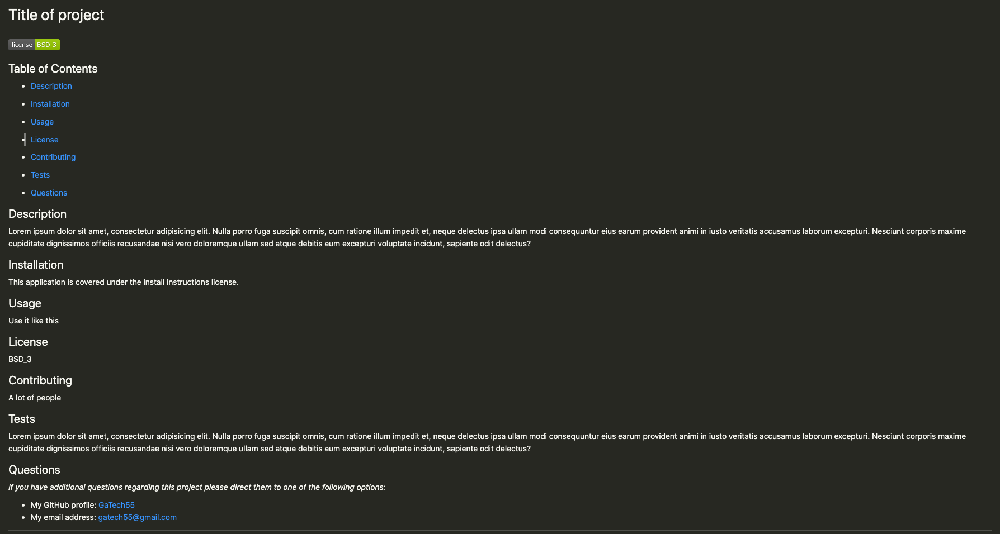

# ReadMeGenerator

David K. Brown's Weather Dashboard

## Table of Contents

- [Description](#description)

- [Screenshots](#screenshots)

- [Acceptance-Criteria](#Acceptance-Criteria)

- [Installation](#installation)

- [Credits](#credits)

- [Contributing](#contributing)

- [Copyright](#copyright)

## Description

The purpose of this project was to allow a user input on the command-line that generates a professionally styled README for a new project. The user is prompted with 9 in-depth questions that gather enough information to complete the README template. Within the template a table of contents provides fast navigation to the different dynamically created sections. Along with details like description, installation and usage the application also provides the license badge and links to the user's email and GitHub profile. For additional details see the gif below.

## Screenshots




## Acceptance-Criteria

```md
GIVEN a command-line application that accepts user input
WHEN I am prompted for information about my application repository
THEN a high-quality, professional README.md is generated with the title of my project and sections entitled Description, Table of Contents, Installation, Usage, License, Contributing, Tests, and Questions
WHEN I enter my project title
THEN this is displayed as the title of the README
WHEN I enter a description, installation instructions, usage information, contribution guidelines, and test instructions
THEN this information is added to the sections of the README entitled Description, Installation, Usage, Contributing, and Tests
WHEN I choose a license for my application from a list of options
THEN a badge for that license is added near the top of the README and a notice is added to the section of the README entitled License that explains which license the application is covered under
WHEN I enter my GitHub username
THEN this is added to the section of the README entitled Questions, with a link to my GitHub profile
WHEN I enter my email address
THEN this is added to the section of the README entitled Questions, with instructions on how to reach me with additional questions
WHEN I click on the links in the Table of Contents
THEN I am taken to the corresponding section of the README
```

## Installation

To access this project you will need to visit my GitHub page and the "WeatherDashboard" repository. After the repository is cloned you can make edits to the project in your repository. Any questions should be directed to [David Brown](mailto:gatech55@gmail.com). The project can be found here: [WeatherDashboard](https://github.com/GaTech55/WeatherDashboard). The website can be found here: [Weather Dashboard](https://gatech55.github.io/WeatherDashboard/).

## Credits

© 2012 — 2020 OpenWeather ® All rights reserved
© 2019 Trilogy Education Services, a 2U, Inc. brand. All Rights Reserved.
[GitLab-06-Homework](https://gt.bootcampcontent.com/GT-Coding-Boot-Camp/gt-inc-fsf-pt-08-2020-u-c/tree/master/06-Server-Side-APIs/02-Homework)

## Contributing

| **Commits** | **Contributor** |

| 20 | [GaTech55](https://github.com/GaTech55)|

## Copyright

Copyright (c) 2020 David Brown.
